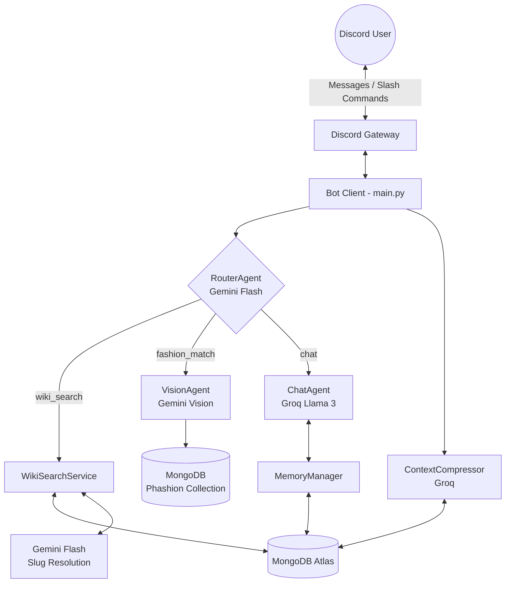

# System Architecture Design

> **Version:** 2.0 — Updated 2026-04-07
>
> **Key change:** Pinecone/VectorDB removed. MongoDB Atlas is the sole database for all storage and retrieval.

The PSO2/NGS Advisor Bot is built on a **Modular Multi-Agent Architecture**. Each component has a single responsibility, which minimises token usage, keeps latency low, and makes it straightforward to add new features without touching unrelated code.

---

## 1. High-Level Overview



The system is **not** a monolithic LLM call. Every incoming message passes through the **RouterAgent** first, which classifies the user's intent and dispatches to the correct specialist agent. This avoids loading unnecessary context and keeps token costs near zero for simple interactions.

---

## 2. Request Flow

```
Discord Message
      │
      ▼
  Fast Route Check ──── greeting / spam / system cmd ──► Pre-defined reply (0 tokens)
      │
      ▼ (needs AI)
  RouterAgent (Gemini Flash)
      │
      ├─ intent: wiki_search ──► WikiSearchService ──► ChatAgent (answer with context)
      ├─ intent: fashion_match ─► VisionAgent ──► PhashionMatcher ──► ChatAgent
      └─ intent: chat ──────────► ChatAgent (persona reply, memory injected)
      │
      ▼
  Response sent to Discord (split if > 2000 chars)
```

---

## 3. Component Details

### A. Bot Client (`main.py`)

The single entry point. Handles Discord events, coordinates all agents, and manages response delivery.

- **Technology**: `discord.py` (Python).
- **Fast Route Bypass**: Regex + keyword matching intercepts greetings, spam, and system commands before any LLM is called. Saves 100% of tokens for ~70% of message volume.
- **Response splitting**: Both slash command replies (`send_long_message`) and message replies (`reply_long`) handle Discord's 2000-char limit.

### B. RouterAgent (`core/agents/router_agent.py`)

Lightweight intent classifier — the gatekeeper that prevents unnecessary LLM calls.

- **Model**: Gemini Flash (free tier, fast).
- **Output**: `IntentResult` with `intent`, `confidence`, `game_version`, `reasoning`.
- **Intents**: `wiki_search`, `fashion_match`, `chat`.
- **Game version detection**: Classifies queries as `ngs` or `pso2` using an entity-game map (e.g., Slayer = NGS-only, Phantom = PSO2-only).

### C. WikiSearchService (`core/wiki_search.py`)

The primary knowledge retrieval system. Replaced the old Pinecone vector search with a deterministic, MongoDB-based pipeline.

- **Step 1 — Slug Resolution**: Sends the user's query to Gemini Flash, which returns the most likely wiki page slug (e.g., `"Portal:New_Genesis/Slayer"`).
- **Step 2 — MongoDB Lookup**: Fetches all `wiki_chunks` and `wiki_tables` documents matching that slug.
- **Step 3 — Text Search Fallback**: If slug lookup returns insufficient data, runs a `$text` search across MongoDB for cross-page results.
- **Step 4 — Context Assembly**: Formats retrieved chunks and tables into a structured context block for the ChatAgent.

### D. ChatAgent (`core/agents/chat_agent.py`)

Generates the final user-facing response.

- **Model**: Groq Llama 3 (free tier, fast inference).
- **Inputs**: User message + extra context (from WikiSearch or VisionAgent) + conversation memory.
- **Persona system**: System prompt loaded from `ai_prompts/characters/` (Matoi, Xiera, etc.).
- **Anti-hallucination**: When wiki context is provided, the prompt forces the LLM to answer only from that context and cite sources.

### E. VisionAgent (`core/agents/vision_agent.py`)

Analyses outfit screenshots for the Phashion reverse-lookup feature.

- **Model**: Gemini Vision (free tier).
- **Input**: Image bytes from Discord attachment.
- **Output**: Structured JSON with outfit tags (hair style, outerwear, accessories, colours).
- **Downstream**: Tags are passed to `PhashionMatcher` which queries MongoDB for matching items.

### F. MemoryManager (`core/memory.py`)

Two-layer conversation memory stored in MongoDB.

- **Short-term**: Recent N messages per user session (injected into every ChatAgent call).
- **Long-term**: Compressed summaries of older conversations (created by ContextCompressor).
- **Storage**: MongoDB `recent_messages` and `memory_summaries` collections.

### G. ContextCompressor (`core/context_compressor.py`)

Background process that prevents memory from growing unbounded.

- **Trigger**: Runs after each ChatAgent reply (non-blocking `asyncio.create_task`).
- **Model**: Groq Llama 3.
- **Action**: When short-term messages exceed a threshold, summarises old messages into a single summary document and archives the originals.

---

## 4. Data Layer

All data lives in **MongoDB Atlas (M0 Free Tier, 512MB)**.

### Collections

| Collection | Purpose | Populated by |
| --- | --- | --- |
| `wiki_chunks` | Text chunks from wiki pages (with `$text` index) | `upload_wiki_to_mongo.py` |
| `wiki_tables` | Structured table data (weapons, skills, augments) | `upload_wiki_to_mongo.py` |
| `phashion_items` | Fashion item catalogue with tags | `phashion_scraper.py` |
| `recent_messages` | Short-term conversation history | `MemoryManager` |
| `memory_summaries` | Compressed long-term memory | `ContextCompressor` |
| `guild_config` | Per-guild bot settings | Bot commands |

### Data Ingestion Pipeline

```
Arks-Visiphone Wiki
        │
        ▼
  wiki_scraper.py (MediaWiki API)
        │
        ├── .chunks.json (text segments)
        ├── .tables.json (structured data)
        └── .meta.json (scrape metadata)
        │
        ▼
  upload_wiki_to_mongo.py
        │
        ▼
  MongoDB Atlas (wiki_chunks + wiki_tables)
```

---

## 5. Infrastructure

| Component | Service | Tier |
| --- | --- | --- |
| Bot runtime | Oracle Cloud / GCP VM | Free tier |
| Database | MongoDB Atlas | M0 free (512MB) |
| LLM — Router + Slug | Google Gemini Flash | Free tier |
| LLM — Chat + Compress | Groq Llama 3 | Free tier |
| LLM — Vision | Gemini Vision | Free tier |
| Monitoring | Prometheus + Grafana | Self-hosted |
| Containerisation | Docker + docker-compose | Self-hosted |

---

## 6. Key Design Decisions

| Decision | Rationale |
| --- | --- |
| Multi-agent over monolith | Each agent loads only the context it needs — reduces token cost by 60%+ |
| MongoDB over Pinecone | Simpler infra, no embedding model dependency, deterministic retrieval via slug resolution |
| Gemini for routing/vision | Free tier generous enough for bot traffic; Flash model is fast for classification |
| Groq for chat | Fastest inference for Llama 3; free tier covers expected volume |
| Fast Route Bypass | Most Discord messages are greetings/spam — intercepting them saves 100% tokens |
| Deterministic slug resolution | More reliable than semantic vector search for PSO2's specialised terminology |
