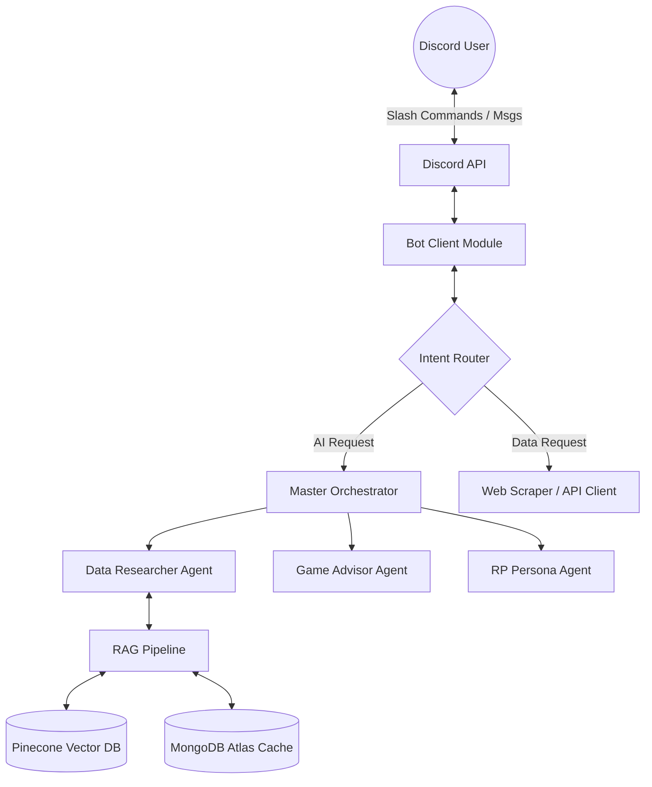

# System Architecture Design

The PSO2/NGS Advisor Bot system is designed based on a **Modular Multi-Agent Architecture** to optimize costs (Tokens), increase processing speed, and easily scale future features.

## 1. High-Level Structure

Instead of cramming all logic into a monolithic block, the system separates the user interaction part (Discord Client) from the knowledge processing part (AI Engine).

## 2. Low-Level Components

### A. Bot Client Module (Communication Interface)
- **Technology**: `discord.py` (Python).
- **Functions**:
  - Listen to Discord events (messages, `/slash` commands).
  - Filter out spam, junk messages, or simple commands that don't require AI (Fast Route Bypass).
  - Manage Webhooks for asynchronous responses (prevents the bot from timing out when AI tasks take a long time).

### B. Master Orchestrator
- The entry point for all requests requiring AI processing.
- Uses compact and high-speed LLMs (like Groq Llama 3) for **Intent Classification**.
- Based on the intent, it calls the correct necessary Worker Agent instead of activating the entire system -> **Significantly reduces Tokens**.

### C. Worker Agents (Specialists)
1. **Data Researcher Agent**:
   - Only activated when questions relate to specific game data (Items, Skills, Lore).
   - Retrieves information from the RAG Pipeline.
2. **Game Advisor Agent**:
   - Analyzes data retrieved by the Researcher to provide build advice, damage multiplier analysis.
3. **RP Persona Agent (Visionary/Speaker)**:
   - Responsible for rephrasing answers according to the character's persona (Matoi, Xiera...).
   - Acts as image analyst (Vision) if a Phashion Look-up is requested.

### D. RAG Pipeline & Storage
- **Embedding**: Converts questions into vectors using `text-embedding-3-small` (or local models).
- **Hybrid Search**: Searches the database using a combination of **Semantic** meaning and **Exact Keyword Matching** to ensure specific PSO2 terminology is not missed.
